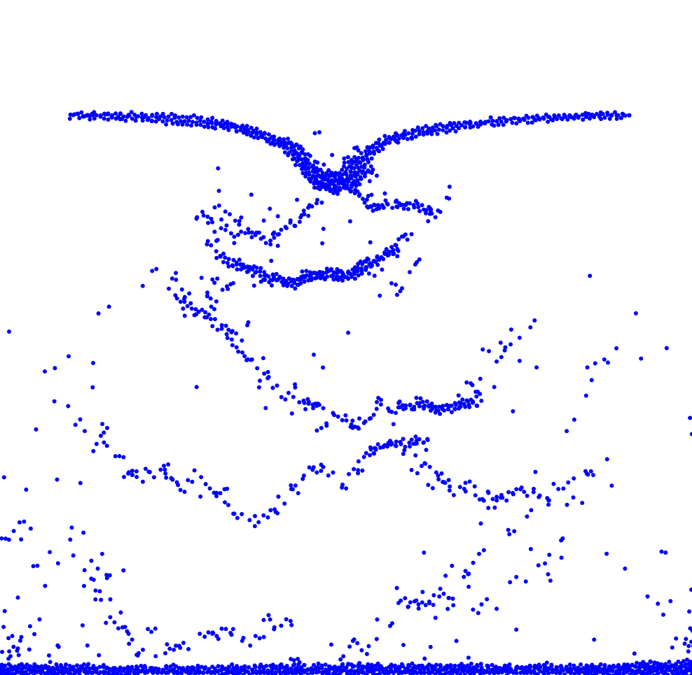

<h1 align="center">Artemis Physics Engine</h1>
<h3 align="center">A customizable GPU accelerated physics engine with native Windows rendering</h3>

<h3 align="left">Description:</h3>
Hi 👋! I'm Alex, and I developed a simple particle fluid physics simulator using C++ with the NVIDIA CUDA toolkits and the Windows DirectX API.

<h3 align="left">Details:</h3>

- Custom Particle and Simulation Settings: The engine allows for fully customizable individual particles (mass, elasticity, initial position, initial velocity, size, etc) and other simulation settings (container size, gravity, etc).

- Optimization: Using GPU-accelerated parallelization, the engine is able to reach 60 fps with over 10,000 particles in real-time.

- Visualization: Fully visualizable in real time using Direct2D rendering for an easy user experience.

<h3 align="left">Future Changes:</h3>

- Improve visualization by tracking pressure

- Allow for custom objects in the container to create a simple CFD

